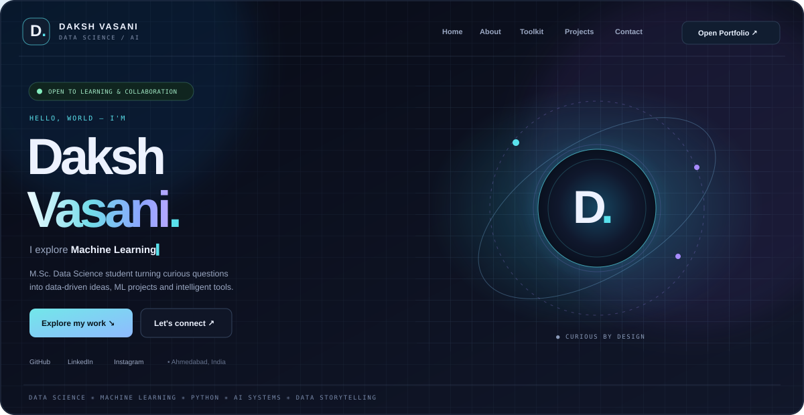

  

  
  

  
  
  

## 👋 About Me

Hi, I'm **Daksh Vasani**, an M.Sc. Data Science student interested in using data, machine learning and Python to build useful, practical applications. I enjoy learning by building projects and exploring how AI can support real-world workflows.

- 🎓 Currently pursuing **M.Sc. in Data Science**
- 📊 Interested in **Data Analysis, Machine Learning, AI and Data Visualization**
- 🧰 Building with **Python, Pandas, Scikit-learn, Django and Streamlit**
- 🤝 Open to learning, collaboration and data-driven projects

## 🛠️ Tech Stack

  

  
  
  
  

## 🚀 Featured Projects

<table>
  <tr>
    <td width="50%" valign="top">
      <h3>🛡️ <a href="https://github.com/VASANI007/CyberMind-AI">CyberMind AI</a></h3>
      
A cybersecurity threat-analysis project bringing scan workflows and threat-intelligence signals into a unified dashboard.

      
Python · Streamlit · Scikit-learn

    </td>
    <td width="50%" valign="top">
      <h3>🤖 <a href="https://github.com/VASANI007/ISHREE-AI">ISHREE AI</a></h3>
      
An evolving personal AI assistant ecosystem exploring conversational AI, agent workflows and productivity automation.

      
Python · AI Agents · NLP

    </td>
  </tr>
  <tr>
    <td width="50%" valign="top">
      <h3>🩺 <a href="https://github.com/VASANI007/DocMindX-AI">DocMindX AI</a></h3>
      
A healthcare-focused AI project exploring symptom insights, medical information and accessible health guidance.

      
Python · Machine Learning · Streamlit

    </td>
    <td width="50%" valign="top">
      <h3>📈 <a href="https://github.com/VASANI007/Multi-Asset-Price-Prediction-System-using-Machine-Learning">Multi-Asset Price Prediction</a></h3>
      
A machine-learning project focused on price prediction across multiple assets.

      
Python · Machine Learning · Data Analysis

    </td>
  </tr>
  <tr>
    <td width="50%" valign="top">
      <h3>🧪 <a href="https://github.com/VASANI007/ML-Studio-Pro-AutoML-Data-Cleaning-Model-Export-System">ML Studio Pro</a></h3>
      
A data-cleaning and AutoML workflow project aimed at making model experimentation easier.

      
Python · AutoML · Data Preparation

    </td>
    <td width="50%" valign="top">
      <h3>🥇 <a href="https://github.com/VASANI007/Gold-Silver-Price-Prediction-ML-System">Gold & Silver Price Prediction</a></h3>
      
A machine-learning project exploring gold and silver price prediction.

      
Python · ML · Visualization

    </td>
  </tr>
</table>

<a href="https://github.com/VASANI007?tab=repositories"><b>Explore all repositories →</b></a>

## 📊 GitHub Activity

  

  
  

## 📬 Connect With Me

  
  
  

Thanks for visiting! Always learning, building and exploring the world of Data Science.

---

> **Note:** GitHub profile READMEs cannot execute embedded JavaScript or page-level CSS. The image above is a visual preview; the interactive portfolio is served separately by GitHub Pages. Follow the included `SETUP.md` to publish `index.html` and activate the live-portfolio link.
